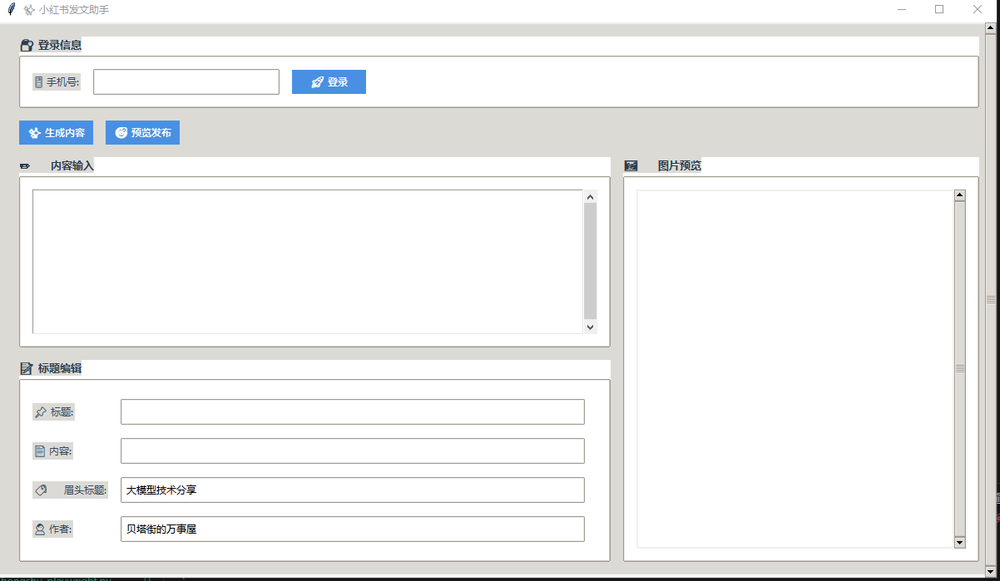

# xhs_ai_publisher

## Project Introduction

`xhs_ai_publisher` is an automation tool designed for publishing articles on Xiaohongshu (RED) platform. This project combines a graphical user interface with automation scripts, leveraging large language models to generate content and automating browser-based login and article publishing, aiming to streamline the content creation and publishing process.



## Key Features

- **User Login**: Login to Xiaohongshu account via phone number, with support for automatic credential saving and loading.
- **Content Generation**: Automatically generate article titles and content using large language models.
- **Image Management**: Automatically download and preview cover and content images.
- **Article Preview & Publishing**: Preview generated articles in browser and proceed with final publishing.

## Main Modules

### easy_ui.py

This module uses `tkinter` to build the graphical user interface, providing:

- **Login Interface**: Phone number input for login.
- **Content Input**: Custom content input triggering content generation.
- **Content Generation**: Call backend API to generate article titles and content, downloading related images.
- **Image Preview**: Display generated cover and content images.
- **Article Preview & Publishing**: Preview and publish generated articles in browser.

### write_xiaohongshu.py

This module uses `selenium` to implement Xiaohongshu platform automation, including:

- **Login Function**: Automate login process, supporting session preservation via Cookies.
- **Article Publishing**: Automatically fill in article titles, content, and upload images to complete publishing.

### xiaohongshu_img.py

This module handles interaction with the large language model API, generating article titles and content, and retrieving image URLs.

## Installation & Usage

1. **Install Dependencies**

   Ensure Python 3.12 is installed, then run:

   ```bash
   pip install -r requirements.txt
   ```

2. **Configure Parameters**

   Modify login phone number and other configurations in `write_xiaohongshu.py`.

3. **Run Program**

   Launch the user interface:

   ```bash
   python easy_ui.py
   ```

4. **Usage Flow**

   - After startup, login to Xiaohongshu account with phone number.
   - Input keywords or descriptions for content generation, click "Generate Content".
   - Program will automatically generate article titles and content, downloading related images.
   - Preview generated content and images, click "Preview & Publish" after confirmation.

## Important Notes

- Ensure `Chrome` browser is installed with corresponding `ChromeDriver` version.
- Verification code is required during login, ensure phone is accessible.
- Review generated content and images before publishing to ensure compliance with platform requirements.
