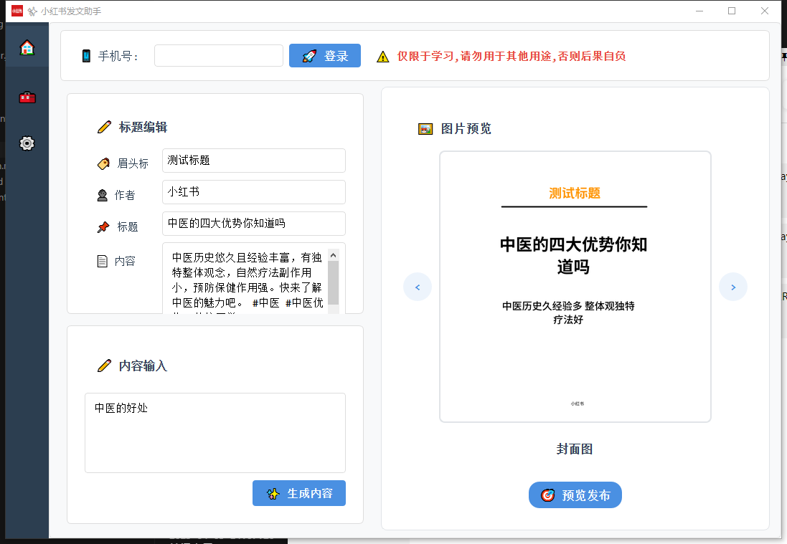

# Xiaohongshu AI Publisher

<div align="center">

[](https://www.python.org/downloads/)
[](LICENSE)
[](https://www.microsoft.com/windows)
[](https://github.com/yourusername/xhs_ai_publisher/releases)

[简体中文](./readme.md) | [English](./readme_en.md)

</div>

## ✨ Project Introduction

`xhs_ai_publisher` is a Python-based automation tool designed for Xiaohongshu content creators. This project combines a graphical user interface with automation scripts, leveraging large language models for content generation and browser automation for login and article publishing, aiming to simplify the content creation and publishing process.



## 🚀 Features

- **Smart Content Generation**: Automatically generates article titles and content using large language models
- **Intelligent Image Processing**: Automatically downloads and previews cover images and content images
- **Easy Login**: Supports phone number login with automatic credential saving
- **One-Click Publishing**: Supports article preview and automatic publishing
- **User-Friendly Interface**: Clean and intuitive graphical interface
- **Scheduled Publishing**: Supports scheduled tasks for automatic article publishing

## 📁 Project Structure

```
xhs_ai_publisher/
├── src/                    # Source code directory
│   ├── core/              # Core functionality modules
│   │   ├── processor/     # Content processing module
│   │   ├── browser/       # Browser automation
│   │   └── pages/         # UI pages
│   ├── cron/              # Scheduled tasks
│   ├── logger/            # Logging module
│   └── config/            # Configuration module
├── static/                # Static resources
├── test/                  # Test directory
├── build/                 # Build output
├── main.py                # Main program entry
└── requirements.txt       # Dependency list
```

## 🛠️ Installation and Usage

### Requirements

- Python 3.8+
- Chrome browser
- Other dependencies listed in requirements.txt

### Installation Steps

1. **Clone the repository**
```bash
git clone https://github.com/yourusername/xhs_ai_publisher.git
cd xhs_ai_publisher
```

2. **Install dependencies**
```bash
pip install -r requirements.txt
```

3. **Run the program**
```bash
python main.py
```

### Usage Process

1. Launch the program and log in with your phone number
2. Set article title and author information in the title editor
3. Enter article topic in the content input area
4. Click "Generate Content" to create the article
5. Preview the generated content and images
6. Click "Preview Publish" after confirmation

## 📦 Quick Start

If you don't want to configure the development environment, you can directly download the packaged Windows executable:

[Download Link](https://pan.baidu.com/s/1rIQ-ZgyHYN_ncVXlery4yQ)  
Extraction code: iqiy

### Usage Instructions
1. Download and extract the package
2. Run `easy_ui.exe` in the folder
3. Follow the interface prompts

### Notes
- Windows system only
- First run may take longer to load
- If antivirus software alerts, please add to trusted list

## 📝 Important Notes

- Ensure Chrome browser is installed with the corresponding ChromeDriver version
- Phone verification code is required during login, please ensure your phone is accessible
- Review generated content and images before publishing
- Regular backup of login credentials and configuration files is recommended

## 🤝 Contributing

Issues and Pull Requests are welcome to help improve the project.

## 📞 Contact

### WeChat


### Official Account


---

<div align="center">
  <sub>Built with ❤️ for Xiaohongshu content creators</sub>
</div>
